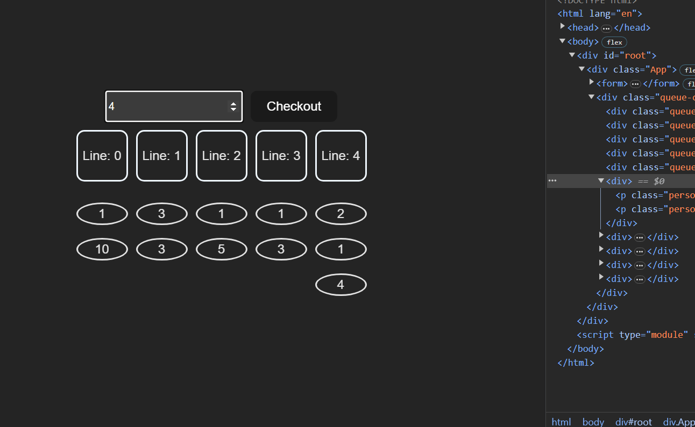

##React Queue Challenge

1- Create an interface where a user can add a number of items and checkout

2- There needs to be 5 queues where user requests will get paid

3- Checking out will put user's request into the least items queue

4- After 5 seconds an item will be removed from the queue

5- When a user has no more items remove it from the queue

